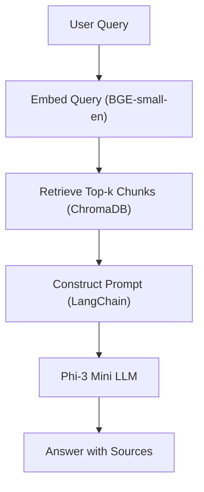
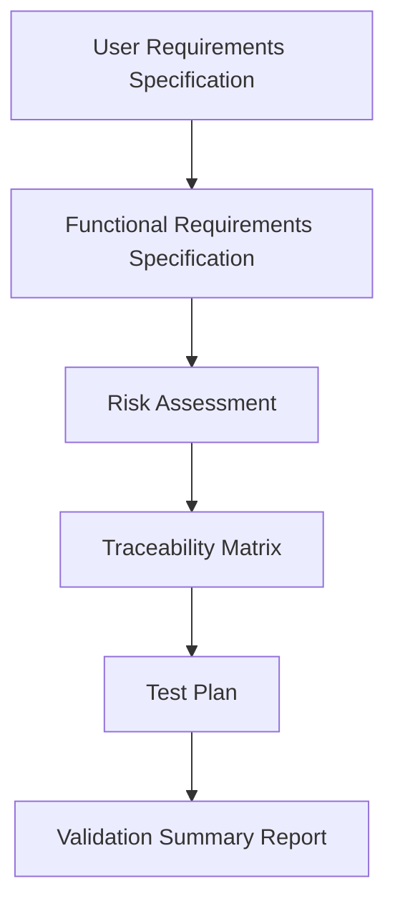

# 📘 CSV RAG Chatbot for Pharma

A Retrieval-Augmented Generation (RAG) chatbot designed to assist with **Computer System Validation (CSV)** and regulatory guidance in pharmaceutical and biotech environments.

This project demonstrates how AI can be built and documented in a **GxP-compliant, validation-style manner**, including requirements, risk assessment, and traceability.

---

## 🚀 Features

- **Phi-3 Mini** language model for grounded responses
- **BAAI/bge-small-en** embeddings for semantic search
- **ChromaDB** vector database for retrieval
- **LangChain** orchestration
- **Streamlit** user interface
- **Validation-style documentation** (URS, FRS, Risk Assessment, Trace Matrix, Test Plan)

---

## 🏗️ Architecture



## 📚 Project Documentation

```markdown
All validation and compliance documentation is organized in the [`docs/`](docs) folder: - [User Requirements Specification (URS)](docs/urs.md) 
- [Functional Requirements Specification (FRS)](docs/frs.md) 
- [Risk Assessment](docs/risk_assessment.md) 
- [Traceability Matrix](docs/traceability_matrix.md) - [Test Plan](docs/test_plan.md) 
- [Validation Summary Report](docs/validation_summary.md)
```
## 📊 Documentation Flow

